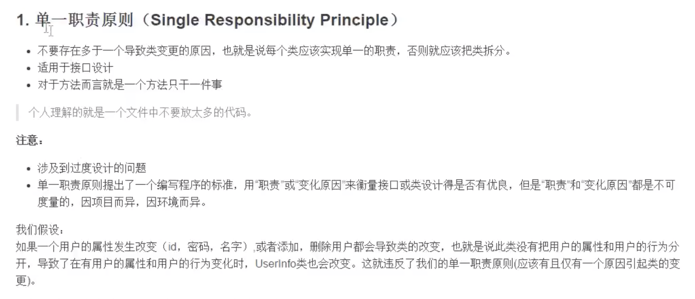
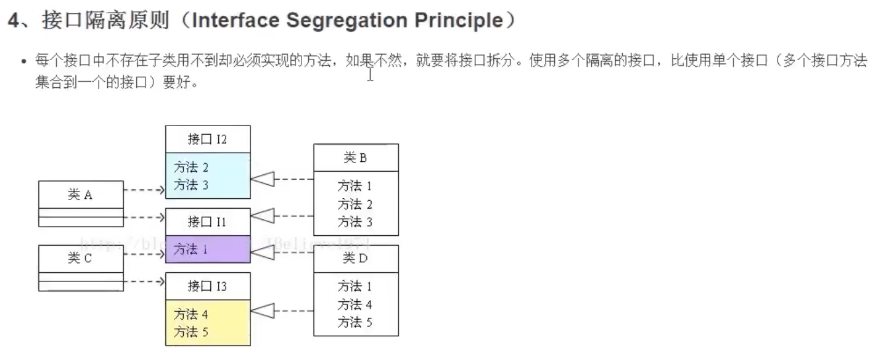
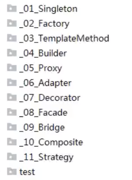

# JavaScript设计模式总结

之前看过《JavaScript设计模式与开发实践》这本书，对书中的设计模式和一些相关案例也有了一定的了解，同时把这些设计模式的应用对应在在一些其他的项目中，进行了一些整理，如下仅供参考：

### 设计模式目的

- 设计模式是为了更好的代码重用性，可读性，可靠性，可维护性。

- 透彻理解设计模式，写出令人赏心悦目的代码

### 设计六大原则

1)单一职责原则



2)里氏替换原则

3)依赖倒转原则

4)接口隔离原则

5)最少知识原则(迪米特法则)

6)开放封闭原则

​	class private public

### 设计模式分类

总体来说设计模式分为三大类：

创建型模式，共五种：工厂方法模式、抽象**工厂模式**、**单例模式**、建造者模式、原型模式。

结构型模式，共七种：**适配器模式**、**装饰器模式**、**代理模式**、外观模式、桥接模式、**组合模式**、享元模式。

行为型模式，共十一种：**策略模式**、模板方法模式、**观察者模式**、迭代子模式、责任链模式、命令模式、备忘录模式、状态模式、访问者模式、中介者模式、解释器模式。

其实还有两类：并发型模式和线程池模式。

不过，对于前端来说，有的设计模式在平时工作中几乎用不到或者很少用到，接下来，我们了解下前端常见的设计模式

### `JS`中的设计模式

常见设计模式：

**1、工厂模式**

> 常见的实例化对象模式，工厂模式就相当于创建实例对象的new，提供一个创建对象的接口

```js
    // 某个需要创建的具体对象
    class Product {
        constructor (name) {
            //属性
            this.name = name;
        }
        //功能
        init () {}
    }
    // 工厂对象
    class Creator {
        create (name) {
            return new Product(name);
        }
    }
    const creator = new Creator();
    const p = creator.create(); // 通过工厂对象创建出来的具体对象

```

比如：生产娃娃的工厂  属性：产地（东南亚/日本）、类型（硅胶/塑料）性别（男/女/未知）、

​			方法（功能）：说话（日本话、泰语），动作：360°自由旋转

应用场景：`JQuery`中的`$`、`Vue.component`异步组件、`React.createElement`、`Axios.get`等

**2、单例模式**

> 保证一个类仅有一个实例，并提供一个访问它的全局访问点，一般登录、购物车等都是一个单例。

```js
    // 单例对象
    class SingleObject {
        login () {}
    }
    // 访问方法
    SingleObject.getInstance = (function () {
        let instance;
        return function () {
            if (!instance) {
                instance = new SingleObject();
            }
            return instance;
        }
    })()
    const obj1 = SingleObject.getInstance();
    const obj2 = SingleObject.getInstance();
    console.log(obj1 === obj2); // true
```

比如：公共厕所、女盆友、随身物品

应用场景：`JQuery`中的`$`、`Vuex`中的`Store`、`Redux`中的`Store`等

**3、适配器模式**

> 用来解决两个接口不兼容问题，由一个对象来包装不兼容的对象，比如参数转换，允许直接访问

```js
    class Adapter {
        specificRequest () {
            return '德国标准插头';
        }
    }
    // 适配器对象，对原来不兼容对象进行包装处理
    class Target {
        constructor () {
            this.adapter = new Adapter();
        }
        request () {
            const info = this.adapter.specificRequest();
            console.log(`${info} - 转换器 - 中国标准插头`)
        }
    }
    const target = new Target();
    console.log(target.request()); // 德国标准插头 - 转换器 - 中国标准插头

```

比如：脱胎换骨，睡了一觉凸然长出了翅膀

应用场景：`Vue`的`computed`、旧的`JSON`格式转换成新的格式等

**4、装饰器模式**

> 在不改变对象自身的基础上，动态的给某个对象添加新的功能，同时又不改变其接口

```js
    class Plane {
        fire () {
            console.log('发送普通子弹');
        }
    }
    // 装饰过的对象
    class Missile {
        constructor (plane) {
            this.plane = plane;
        }
        fire () {
            this.plane.fire();
            console.log('发射导弹');
        }
    }
    let plane = new Plane();
    plane = new Missile(plane);
    console.log(plane.fire()); // 依次打印 发送普通子弹 发射导弹
```

比如：改造（比如 娃娃不能趴着）

利用`AOP`给函数动态添加功能，即`Function`的after或者`before`

```js
Function.prototype.before = function (beforeFn) {
  const _self = this;
  return function () {
    beforeFn.apply(this, arguments);
    return _self.apply(this, arguments);
  }
}

Function.prototype.after = function (afterFn) {
  const _self = this;
  return function () {
    const ret = _self.apply(this, arguments);
    afterFn.apply(this, arguments);
    return ret;
  }
}

let func = function () {
  console.log('2');
}

func = func.before(function() {
  console.log('1');
}).after(function() {
  console.log('3');
})

func();
console.log(func()); // 依次打印 1 2 3
```

应用场景：`redux`中间件`thunk `、`ES7`装饰器、`Vuex`中1.0版本混入`Vue`时，重写`init`方法、`Vue`中数组变异方法实现等

**5、代理模式**

> 为其他对象提供一种代理，便以控制对这个对象的访问，不能直接访问目标对象

```js
class Flower {}
// 源对象
class Jack {
    constructor (target) {
        this.target = target;
    }
    sendFlower (target) {
        const flower = new Flower();
        this.target.receiveFlower(flower)
    }
}
// 目标对象
class Rose {
    receiveFlower (flower) {
        console.log('收到花: ' + flower)
    }
}
// 代理对象
class ProxyObj {
    constructor () {
        this.target = new Rose();
    }
    receiveFlower (flower) {
        this.sendFlower(flower)
    }
    sendFlower (flower) {
        this.target.receiveFlower(flower)
    }
}
const proxyObj = new ProxyObj();
const jack = new Jack(proxyObj);
jack.sendFlower(proxyObj); // 收到花：[object Object]

```

比如：我是他老子

应用场景：`ES6 Proxy`、`Vuex`中对于`getters`访问、图片预加载等

**6、外观模式**

> 为一组复杂的子系统接口提供一个更高级的统一接口，通过这个接口使得对子系统接口的访问更容易，不符合单一职责原则和开放封闭原则

```js
class A {
    eat () {}
}
class  B {
    eat () {}
}
class C {
    eat () {
        const a = new A();
        const b = new B();
        a.eat();
        b.eat();
    }
}
// 跨浏览器事件侦听器
function addEvent(el, type, fn) {
    if (window.addEventListener) {
        el.addEventListener(type, fn, false);
    } else if (window.attachEvent) {
        el.attachEvent('on' + type, fn);
    } else {
        el['on' + type] = fn;
    }
}
```

比如：暗恋

应用场景：`JS`事件不同浏览器兼容处理、同一方法可以传入不同参数兼容处理等

**7、观察者模式**

> 定义对象间的一种一对多的依赖关系，当一个对象的状态发生改变时，所有依赖于它的对象都将得到通知

```js
  class Subject {
  constructor () {
    this.state = 0;
    this.observers = [];
  }
  getState () {
    return this.state;
  }
  setState (state) {
    this.state = state;
    this.notify();
  }
  notify () {
    this.observers.forEach(observer => {
      observer.update();
    })
  }
  attach (observer) {
    this.observers.push(observer);
  }
}


class Observer {
  constructor (name, subject) {
    this.name = name;
    this.subject = subject;
    this.subject.attach(this);
  }
  update () {
    console.log(`${this.name} update, state: ${this.subject.getState()}`);
  }
}

let sub = new Subject();
let observer1 = new Observer('o1', sub);
let observer2 = new Observer('o2', sub);

sub.setState(1);
```

**观察者模式 与 发布/订阅模式区别: 本质上的区别是调度的地方不同**

虽然两种模式都存在订阅者和发布者（具体观察者可认为是订阅者、具体目标可认为是发布者），但是观察者模式是由具体目标调度的，而发布/订阅模式是统一由调度中心调的，所以观察者模式的订阅者与发布者之间是存在依赖的，而发布/订阅模式则不会。

---观察者模式：目标和观察者是基类，目标提供维护观察者的一系列方法，观察者提供更新接口。具体观察者和具体目标继承各自的基类，然后具体观察者把自己注册到具体目标里，在具体目标发生变化时候，调度观察者的更新方法。
比如有个“天气中心”的具体目标A，专门监听天气变化，而有个显示天气的界面的观察者B，B就把自己注册到A里，当A触发天气变化，就调度B的更新方法，并带上自己的上下文。

---发布/订阅模式：订阅者把自己想订阅的事件注册到调度中心，当该事件触发时候，发布者发布该事件到调度中心（顺带上下文），由调度中心统一调度订阅者注册到调度中心的处理代码。
比如有个界面是实时显示天气，它就订阅天气事件（注册到调度中心，包括处理程序），当天气变化时（定时获取数据），就作为发布者发布天气信息到调度中心，调度中心就调度订阅者的天气处理程序。

比如：观察对方是否喜欢自己、警察和小偷

应用场景：`JS`事件、`JS Promise`、`JQuery.$CallBack`、`Vue watch`、`NodeJS`自定义事件，文件流等

**8、迭代器模式**

> 提供一种方法顺序访问一个聚合对象中各个元素, 而又无须暴露该对象的内部表示

可分为：内部迭代器和外部迭代器

内部迭代器： 内部已经定义好迭代规则，外部只需要调用一次即可。

```js
const each = (args, fn) => {
  for (let i = 0, len = args.length; i < len; i++) {
    const value = fn(args[i], i, args);

    if (value === false) break;
  }
}
```

应用场景：` JQuery.each`方法  、`Array.prototype.map`

外部迭代器：必须显示的请求迭代下一个元素。

```js
// 迭代器
class Iterator {
  constructor (list) {
    this.list = list;
    this.index = 0;
  }
  next () {
    if (this.hasNext()) {
      return this.list[this.index++]
    }
    return null;
  }
  hasNext () {
    if (this.index === this.list.length) {
      return false;
    }
    return true;
  }
}
const arr = [1, 2, 3, 4, 5, 6];
const ite = new Iterator(arr);

while(ite.hasNext()) {
  console.log(ite.next()); // 依次打印 1 2 3 4 5 6
}
```

应用场景：`JS Iterator`、`JS Generator`、遍历链表中的`next`、二叉树遍历中的`left/right`

**9、状态模式**

> 关键是区分事物内部的状态，事物内部状态往往会带来事物的行为改变，即允许对象在内部状态发生改变时改变它的行为

```js
// 红灯
class RedLight {
    constructor (state) {
        this.state = state;
    }
    light () {
        console.log('turn to red light');
        this.state.setState(this.state.greenLight)
    }
}
// 绿灯
class greenLight {
    constructor (state) {
        this.state = state;
    }
    light () {
        console.log('turn to green light');
        this.state.setState(this.state.yellowLight)
    }
}
// 黄灯
class yellowLight {
    constructor (state) {
        this.state = state;
    }
    light () {
        console.log('turn to yellow light');
        this.state.setState(this.state.redLight)
    }
}
class State {
    constructor () {
        this.redLight = new RedLight(this)
        this.greenLight = new greenLight(this)
        this.yellowLight = new yellowLight(this)
        this.setState(this.redLight) // 初始化为红灯
    }
    setState (state) {
        this.currState = state;
    }
}
const state = new State();
state.currState.light() // turn to red light
setInterval(() => {
    state.currState.light() // 每隔3秒依次打印红灯、绿灯、黄灯
}, 3000)
```

比如：女生的心情

应用场景：灯泡状态、红绿灯切换等

其他设计模式：

**10、命令模式**
**11、组合模式**
**12、享元模式**
**13、策略模式**
**14、职责链模式**
**15、模板方法模式**
**16、中介者模式**
**17、备忘录模式**
**18、访问者模式**
**19、解释器模式**
**20、桥接模式**

